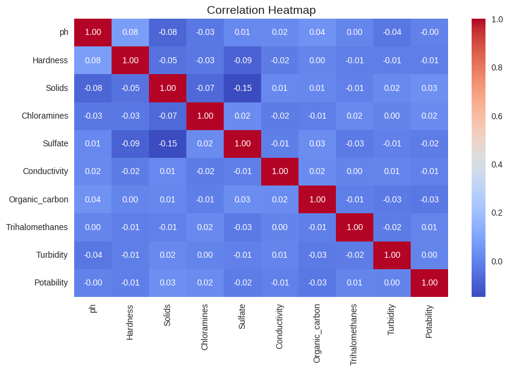
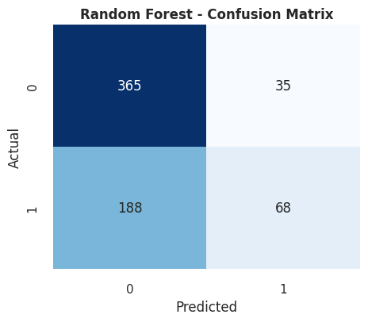
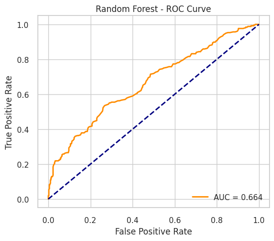
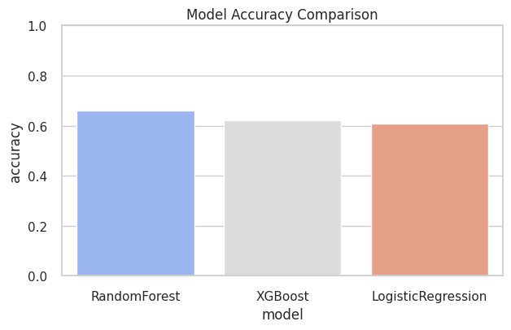
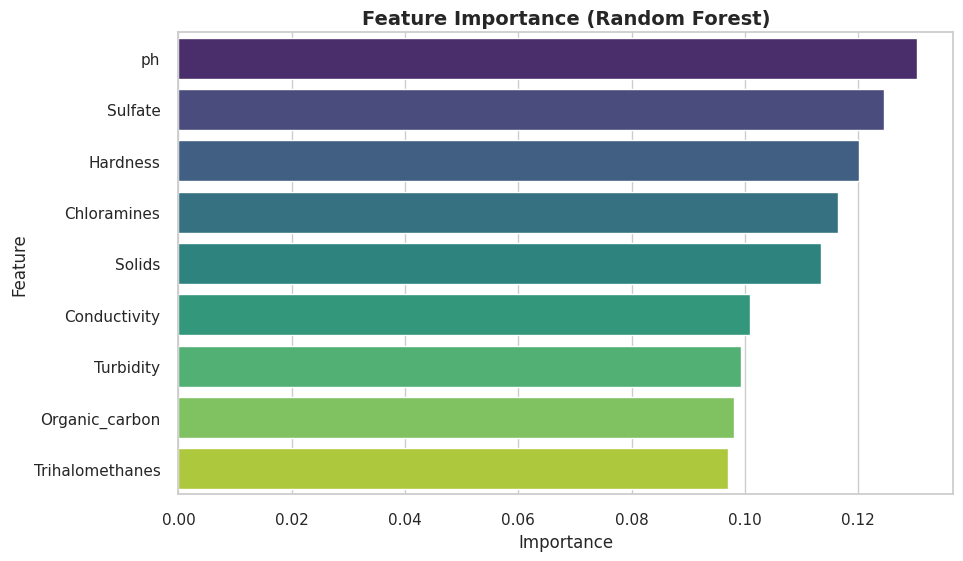
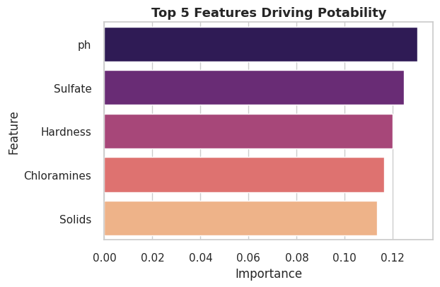

# Water Quality Monitoring - AI/ML Internship Project

This repository contains my work for the AICTE Edunet AI/ML Internship Project on **Water Quality Monitoring**.

## 📂 Repository Structure
- `dataset/` → contains water_potability.csv dataset  
- `notebooks/` → contains Colab notebooks  
- `README.md` → project documentation  
- `requirements.txt` → Python dependencies  

## ✅ Week 1: Data Understanding  

During Week 1, the focus was on **importing and exploring the dataset** to understand its structure and quality.  

### 🔹 Key Steps
- Imported the dataset `water_potability.csv` from Kaggle  
- Checked dataset structure using:  
  - `.info()` → data types & non-null values  
  - `.describe()` → summary statistics  
  - `.isnull().sum()` → missing value counts  
  - `.shape` → dataset dimensions

### 🔹 Insights
- The dataset contains **9 water quality features** + `Potability` (target variable).  
- Missing values were detected in `ph`, `Sulfate`, and `Trihalomethanes`.  
- Dataset size: **3276 rows × 10 columns**.  


## ✅ Week 2: Data Preprocessing & Cleaning  

During Week 2, the focus was on **cleaning and preparing the dataset** for machine learning.  

### 🔹 Key Steps
- Handled **missing values** in critical features:  
  - `ph` → filled using mean imputation  
  - `Sulfate` → filled using mean imputation  
  - `Trihalomethanes` → filled using mean imputation  
- Removed **duplicate records** to ensure dataset quality  
- Converted dataset into a **clean and analysis-ready version**  

### 🔹 Exploratory Data Analysis (EDA)
- Generated **summary statistics** (`.describe()`)  
- Created **distribution plots** (histograms, boxplots)  
    

- Used a **heatmap correlation matrix** to identify relationships between features  
    

### 🔹 Output
- Saved cleaned dataset as:  
  - 📂 `dataset/cleaned_water_potability.csv`  

### 🔹 Insights
- Significant missing values were present initially, especially in `ph`, `Sulfate`, and `Trihalomethanes`.  
- Correlation analysis showed moderate relationships between some features.  
- Dataset imbalance was observed (`Potability = 0` has more samples than `Potability = 1`).  


## ✅ Week 3: Machine Learning Models
- Built classification models to predict **water potability**
- Implemented a **complete ML pipeline**:
  - Train-test split with stratification  
  - Feature scaling  
  - Trained models: Logistic Regression, Random Forest, (optional XGBoost)  
  - Evaluated with Accuracy, Precision, Recall, F1, ROC-AUC  
- Generated **visualizations**:
  - Confusion matrices  
  - ROC curves  
  - Model accuracy comparison  
  - Feature importance (Random Forest)  
- Produced a **model comparison table** and saved results to CSV  
- Wrote final **insights and recommendations** 

### 📊 Models Implemented
1. **Logistic Regression** → Baseline linear model  
2. **Random Forest Classifier** → Non-linear, handles imbalance with `class_weight="balanced"`
3. **XGBoost Classifier** → Gradient boosting, robust to overfitting, handles missing values and class imbalance with `scale_pos_weight`

### 🔹 Results
| Model                | Accuracy | ROC-AUC |
|-----------------------|----------|---------|
| Logistic Regression   | ~0.61    | ~0.55   |
| Random Forest         | ~0.66    | ~0.66   |
| XGBoost               | ~0.62    | ~0.55   |

## 📊 Results Summary
- Models used: Logistic Regression, Random Forest, XGBoost (if installed)  
- Metrics evaluated: Accuracy, Precision, Recall, F1, ROC-AUC  
- Random Forest generally gave **highest accuracy** with important features identified.  
👉 Random Forest outperforms Logistic Regression and XGBoost in both accuracy and AUC.

See [`results_summary.csv`](./results_summary.csv) for complete metrics.

---

## 📊 Model Results & Visualizations  

### Confusion Matrix – Random Forest  
  

### ROC Curve Comparison  
  

### Model Accuracy Comparison  
  

### Feature Importance  
  

### Top 5 Features  
  

---

### 🔹 Key Insights
- **Random Forest** is more reliable for this dataset.  
- **Important features**: `pH`, `Solids`, `Sulfate`, and `Trihalomethanes`.  
- Dataset imbalance still affects performance; future improvements can use **SMOTE** or **Ensemble Methods**.  

## 🚀 How to Run
1. Clone the repository  
 - ```bash
   git clone https://github.com/SonuKumar7065/Water-Quality-Monitoring-ML-Project.git
   cd Water-Quality-Monitoring-ML-Project
2. Install dependencies
  - ```bash
    pip install -r requirements.txt
3. Ensure dataset is available:
   - Place cleaned_water_potability.csv inside dataset/
   - Or upload it in Colab if running there
4. Run the notebook
   - Open notebooks/Week3_Water_Quality_Final.ipynb in Jupyter/Colab
   - Run all cells to train models and generate results

## 🔧 Requirements
1. Python 3.8+
2. Libraries: pandas, numpy, scikit-learn, seaborn, matplotlib, (optional: xgboost)
3. Install all at once:
   - ```bash
     pip install -r requirements.txt

## 📝 Final Insights
- Best Model: Random Forest (highest accuracy & stable performance)
- Key Features: Certain chemical properties (pH, Sulfate, Hardness, etc.) strongly influence water potability
- Future Work: Try SMOTE for class imbalance, hyperparameter tuning, and ensemble methods to improve recall

## 👨‍💻 Author: Sonu Kumar
