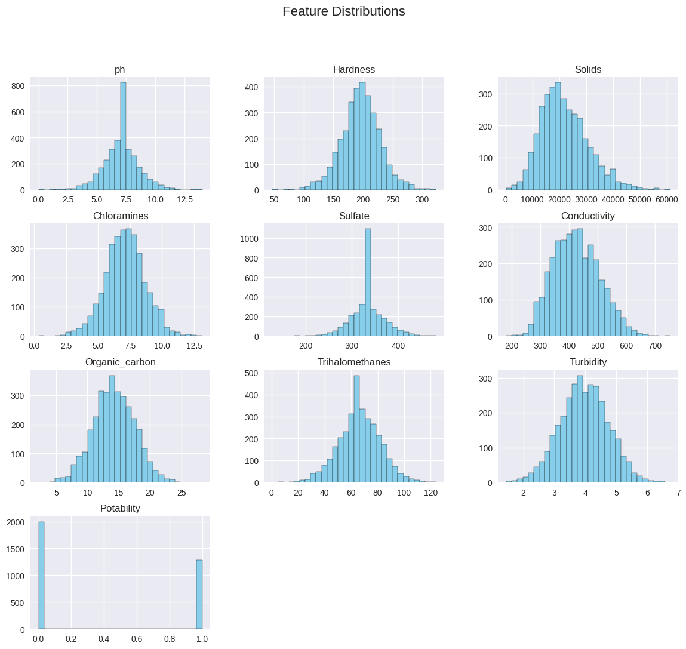
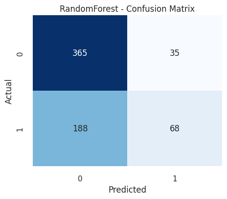
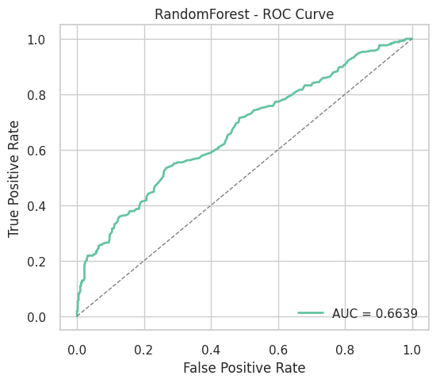
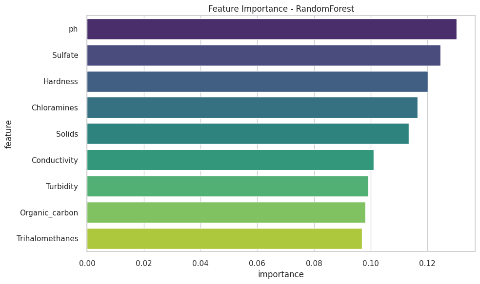
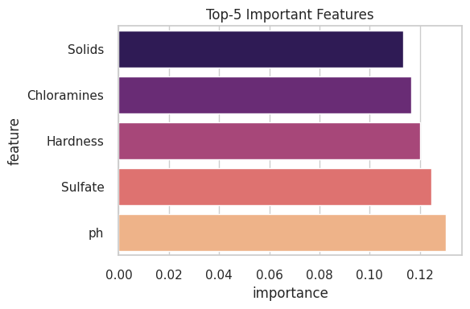

# Water Quality Monitoring - AI/ML Internship Project

This repository contains my work for the AICTE Edunet AI/ML Internship Project on **Water Quality Monitoring**.

## 📂 Repository Structure
- `dataset/` → contains water_potability.csv dataset  
- `notebooks/` → contains Colab notebooks  
- `README.md` → project documentation  
- `requirements.txt` → Python dependencies  

## ✅ Week 1: Data Understanding  

During Week 1, the focus was on **importing and exploring the dataset** to understand its structure and quality.  

### 🔹 Key Steps
- Imported the dataset `water_potability.csv` from Kaggle  
- Checked dataset structure using:  
  - `.info()` → data types & non-null values  
  - `.describe()` → summary statistics  
  - `.isnull().sum()` → missing value counts  
  - `.shape` → dataset dimensions

### 🔹 Insights
- The dataset contains **9 water quality features** + `Potability` (target variable).  
- Missing values were detected in `ph`, `Sulfate`, and `Trihalomethanes`.  
- Dataset size: **3276 rows × 10 columns**.  

## ✅ Week 2: Data Preprocessing & Cleaning  

During Week 2, the focus was on **cleaning and preparing the dataset** for machine learning.  

### 🔹 Key Steps
- Handled **missing values** in critical features:  
  - `ph` → filled using mean imputation  
  - `Sulfate` → filled using mean imputation  
  - `Trihalomethanes` → filled using mean imputation  
- Removed **duplicate records** to ensure dataset quality  
- Converted dataset into a **clean and analysis-ready version**  

### 🔹 Exploratory Data Analysis (EDA)
- Generated **summary statistics** (`.describe()`)  
- Created **distribution plots** (histograms, boxplots)  
    

- Used a **heatmap correlation matrix** to identify relationships between features  
    

### 🔹 Output
- Saved cleaned dataset as:  
  - 📂 `dataset/cleaned_water_potability.csv`  

### 🔹 Insights
- Significant missing values were present initially, especially in `ph`, `Sulfate`, and `Trihalomethanes`.  
- Correlation analysis showed moderate relationships between some features.  
- Dataset imbalance was observed (`Potability = 0` has more samples than `Potability = 1`).  

## ✅ Week 3: Machine Learning Models
- Built classification models to predict **water potability**  

### 📊 Models Implemented
1. **Logistic Regression** → Baseline linear model  
2. **Random Forest Classifier** → Non-linear, handles imbalance with `class_weight="balanced"`
3. **XGBoost Classifier** → Gradient boosting, robust to overfitting, handles missing values and class imbalance with `scale_pos_weight`

### 🔹 Results
| Model                | Accuracy | ROC-AUC |
|-----------------------|----------|---------|
| Logistic Regression   | ~0.61    | ~0.55   |
| Random Forest         | ~0.66    | ~0.66   |
| XGBoost               | ~0.62    | ~0.55   |

👉 Random Forest outperforms Logistic Regression and XGBoost in both accuracy and AUC.  

---

## 📊 Model Results & Visualizations  

### Confusion Matrix – Random Forest  
  

### ROC Curve Comparison  
  

### Model Accuracy Comparison  
  

### Feature Importance  
  

### Top 5 Features  
  

---

### 🔹 Key Insights
- **Random Forest** is more reliable for this dataset.  
- **Important features**: `pH`, `Solids`, `Sulfate`, and `Trihalomethanes`.  
- Dataset imbalance still affects performance; future improvements can use **SMOTE** or **Ensemble Methods**.  

## 🚀 How to Run
1. Clone this repository or download the files.
2. Open Google Colab or Jupyter Notebook.
3. Upload and run the notebooks from the notebooks/ folder.
4. Install dependencies using:
   pip install -r requirements.txt
